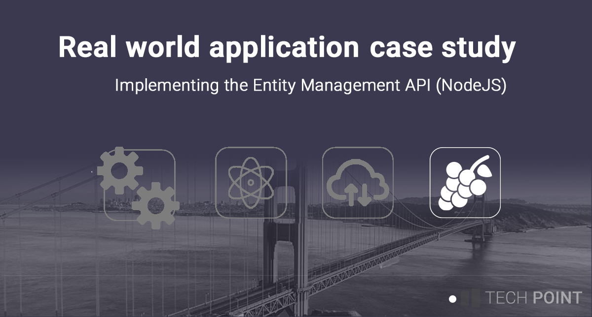

# ERP Entity Management API (NodeJS)

## Description
As part of the ERP demo application, this project provides API endpoints for entity management 
operations on commonly used objects. For example, 

* Tanks
* Operation codes 
* Ingredients

Write operations on these types of objects typically are typically not performed by the average 
end user, but by a user with an adminitrative role.

The main directory contains the node project directory under the 'app' sub directory, and contains 
Docker related files at the top level.

## Accessing the API documentation
As a *quality of life* aspect, documentation has been established under the ./app/api-docs folder. 
The following command will generate HTML documentation for all API calls.

`yarn run gen-docs`.

The file ./app/api-docs/open-api.yaml contains the definitions in the Open API format 
(https://www.openapis.org/). 

## Initial project setup
You will need to provide the database credentials by copying the '.env.example' file into a new 
file called '.env', and updating the parameters as appropriate for you *mariadb instance*. 

## Building the application
`yarn run build` 

## Running the application locally
`yarn run dev`
The above comand will start the application running under port 5176. The following curl command
may be used to validate successfull deployment.

`curl -v 'http://localhost:5176/entity/tank'`

## Example curl calls

List all tanks
`curl -v 'http://localhost/entity-mgmnt' `

List all operation codes
``

## Enhancement log

You can find more details on my personal blog [https://www.matthewdalby.dev]()