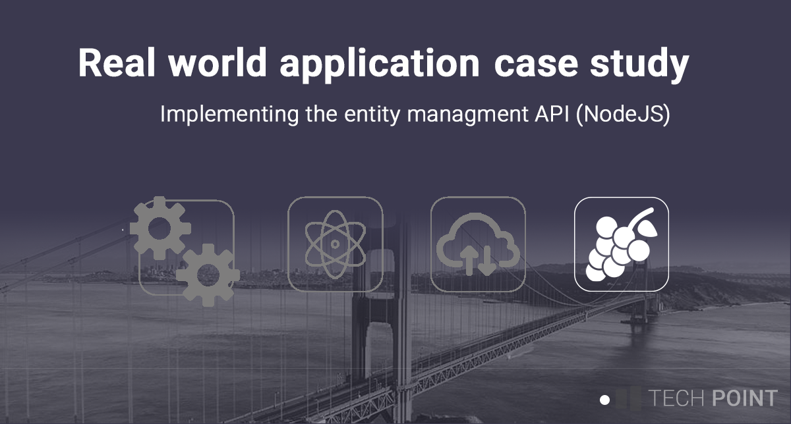

# ERP Entity Management API (NodeJS)

## Description
As part of the ERP demo application, this project provides API endpoints for entity management operations on commonly used objects. For example, 

* Tanks
* Operation codes 
* Ingredients

Write operations on these types of objects typically are typically not performed by the average end user, but by a user with an adminitrative role.

## Building the application
`npm run start-dev` 

## Enhancement log

You can find more details on my personal blog [https://www.matthewdalby.dev]()